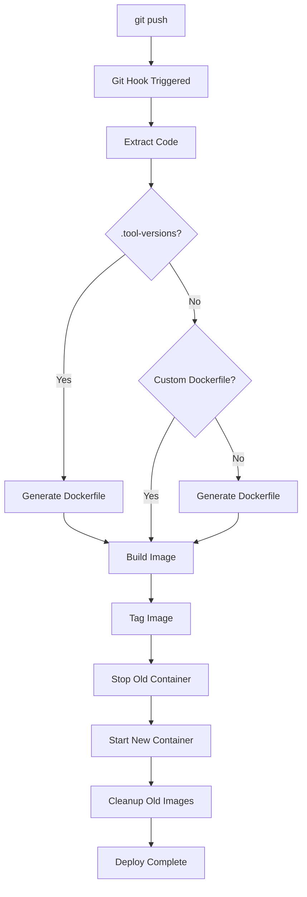

# Deployment

Learn how to deploy your applications with Gokku.

## Overview

Gokku uses a **git-push deployment** workflow:

1. Push code to Git remote on server
2. Git hook triggers automatically
3. Code is built and deployed
4. Service restarts with new version

## First Deployment

### 1. Create gokku.yml

In your project root:

```yaml
apps:
  app-name: api
    build:
      path: ./cmd/api
```

### 2. Add Git Remote

On your local machine:

```bash
git remote add production ubuntu@server:api
```

### 3. Deploy (Auto-Setup)

```bash
git push production main
```

The first push automatically creates:
- Git repository
- App directories
- Docker containers
- Environment file from `gokku.yml`

Watch the deployment:

```
Counting objects: 100, done.
-----> Deploying api to production...
-----> Extracting code to /opt/gokku/apps/api/production/releases/1
-----> Building api...
-----> Build complete (binary: 5.2M)
-----> Creating symlink: current -> releases/1
-----> Restarting api-production...
-----> Deploy successful!
To ubuntu@server:api
   abc1234..def5678  main -> main
```

### 5. Verify

```bash
# Check container status
ssh ubuntu@server "docker ps | grep api"

# Check logs
ssh ubuntu@server "docker logs -f api"

# Test endpoint
curl http://your-server:8080/health
```

## Deployment Flow

### Docker Apps



## Directory Structure

### Docker Deployment

```
/opt/gokku/apps/api/production/
├── .env            # Environment variables
├── deploy.log      # Deployment logs
└── (Docker images stored in Docker)
```

## Deployment Settings

Configure in `gokku.yml`:

```yaml
apps:
  app-name: api
    deployment:
      keep_releases: 10       # Number of releases to keep
      keep_images: 10         # Number of Docker images to keep
      restart_policy: always  # Restart policy
      restart_delay: 5        # Seconds between restarts
```

### Restart Policies

- `always` - Always restart on failure (default)
- `on-failure` - Restart only on non-zero exit
- `no` - Never restart

## Atomic Deployments

Gokku uses **atomic deployments** for zero-downtime:

### How It Works

1. **Build in new directory** - New release doesn't affect running app
2. **Update symlink atomically** - Instant switch to new version
3. **Restart service** - Picks up new code

```bash
# Old version running
current -> releases/3

# New version built
releases/4/  (ready)

# Atomic switch
current -> releases/4  (instant)

# Restart picks up new code
docker restart api
```

### Downtime

- **Standard Docker**: ~2-5 seconds during container swap
- **Blue-Green (ZERO_DOWNTIME=1)**: Zero downtime with instant traffic switch

Add remotes:

```bash
git remote add production ubuntu@server:api
git remote add staging ubuntu@server:api
```

### Deploy

```bash
# Deploy to staging
git push staging staging

# Test staging
curl https://staging.example.com/health

# Deploy to production
git push production main
```

## Deployment Strategies

### 1. Direct to Production

Simple and fast:

```bash
git push production main
```

**Pros:**
- Fast
- Simple

**Cons:**
- No testing
- Risky

**Use when:**
- Small projects
- Solo developer
- Low traffic

### 2. Staging → Production

Test before production:

```bash
# 1. Deploy to staging
git push staging main

# 2. Test
./test-staging.sh

# 3. Deploy to production
git push production main
```

**Pros:**
- Catch bugs early
- Safe

**Cons:**
- Slower
- More setup

**Use when:**
- Team projects
- Critical apps
- Customer-facing

### 3. Feature Branches

Deploy branches to test:

```bash
# Deploy feature branch to staging
git push staging feature/new-ui

# Test
curl https://staging.example.com

# Merge and deploy to production
git checkout main
git merge feature/new-ui
git push production main
```

### 4. Blue-Green (Manual)

Run two production instances:

```bash
# Setup blue and green
./deploy-server-setup.sh api-blue production
./deploy-server-setup.sh api-green production

# Deploy to green (inactive)
git push api-green main

# Test green
curl https://green.example.com

# Switch load balancer to green
# (manual nginx/haproxy config)

# Green is now live, blue is standby
```

## Deployment Hooks

### Pre-Deploy (Manual)

Add to your app:

```bash
# scripts/pre-deploy.sh
#!/bin/bash
echo "Running tests..."
go test ./...
```

Run before deploying:

```bash
./scripts/pre-deploy.sh && git push production main
```

### Post-Deploy (Manual)

```bash
# scripts/post-deploy.sh
#!/bin/bash
curl https://api.example.com/health || exit 1
echo "Deployment verified!"
```

Run after deploying:

```bash
git push production main && ./scripts/post-deploy.sh
```

### Custom Hooks (Advanced)

Modify Git hook template:

`/opt/gokku/hooks/post-receive-*.template`

Add custom logic before/after build.

## Monitoring Deployments

### View Deploy Logs

```bash
ssh ubuntu@server "cat /opt/gokku/apps/api/production/deploy.log"
```

### View Service Logs

```bash
# Docker
ssh ubuntu@server "docker logs -f api-production"
```

### Check Status

```bash
# Docker
ssh ubuntu@server "docker ps | grep api"
```

## Troubleshooting Deployments

### Build Failed

Check deploy log:

```bash
ssh ubuntu@server "cat /opt/gokku/apps/api/production/deploy.log"
```

Common issues:
- Missing dependencies
- Compilation errors
- Wrong paths in config

### Service Won't Start

Check service logs:

```bash
ssh ubuntu@server "sudo journalctl -u api-production -n 100"
```

Common issues:
- Port already in use
- Missing environment variables
- Syntax errors in code

### Deploy Hangs

Check Git hook:

```bash
ssh ubuntu@server "ls -la api/hooks/"
```

Make sure `post-receive` is executable:

```bash
ssh ubuntu@server "chmod +x api/hooks/post-receive"
```

### Rollback Failed Deploy

See [Rollback Guide](/guide/rollback).

## Best Practices

### 1. Test Before Deploy

```bash
# Local tests
go test ./...
python -m pytest
npm test

# Then deploy
git push production main
```

### 2. Deploy Staging First

```bash
git push staging main
# Test staging
git push production main
```

### 3. Monitor After Deploy

```bash
# Watch logs
ssh ubuntu@server "sudo journalctl -u api-production -f"

# Check metrics
curl https://api.example.com/metrics
```

### 4. Small, Frequent Deploys

✅ Good: Deploy daily with small changes

❌ Bad: Deploy monthly with huge changes

### 5. Keep Rollback Ready

Always have a plan to rollback:

```bash
# Know how to rollback
ssh ubuntu@server "cd /opt/gokku/apps/api/production && ls releases/"
```

### 6. Use Environment Variables

Don't hardcode configs:

```go
// Bad
db := "postgres://localhost/prod"

// Good
db := os.Getenv("DATABASE_URL")
```

### 7. Health Checks

Add health check endpoint:

```go
http.HandleFunc("/health", func(w http.ResponseWriter, r *http.Request) {
    w.Write([]byte("OK"))
})
```

Test after deploy:

```bash
curl https://api.example.com/health
```

## CI/CD Integration (Future)

Deploy from GitHub Actions:

```yaml
# .github/workflows/deploy.yml
name: Deploy

on:
  push:
    branches: [main]

jobs:
  deploy:
    runs-on: ubuntu-latest
    steps:
      - uses: actions/checkout@v3
      
      app-name: Deploy
        run: |
          git remote add production ${{ secrets.GOKKU_REMOTE }}
          git push production main
```

## Next Steps

- [Rollback](/guide/rollback) - Revert failed deployments
- [Environment Variables](/guide/env-vars) - Configure apps
- [Docker Support](/guide/docker) - Deploy with Docker
- [Examples](/examples/) - Real-world examples

