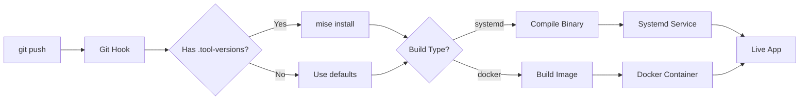

# What is Gokku?

**Gokku** is a lightweight, git-push deployment system designed for Go applications (but supports Python, Node.js, and more).

## The Name

**Gokku** = **Go** + Do**kku**

It's inspired by [Dokku](https://dokku.com/) but focuses on:
- Go-first design
- Simpler configuration
- Optional Docker (not required)
- Native systemd support
- Automatic runtime management with mise/asdf

## Core Philosophy

1. **Git-Push Simplicity**: Deploy with `git push`, just like Heroku
2. **Configuration as Code**: Everything in `gokku.yml`
3. **Sensible Defaults**: Minimal config required
4. **Runtime Flexibility**: Choose systemd, Docker, or native per app
5. **Tool Version Management**: Automatic via mise/asdf

## How It Works



## Key Features

### 🚀 Git-Push Deployment

```bash
git push production main
```

That's it. Your app builds, deploys, and restarts automatically.

### 🔧 Multi-Language

- **Go**: Native compilation with systemd
- **Python**: Docker or native with mise
- **Node.js**: Docker or native with mise
- **Ruby, Rust, etc**: Via mise/asdf

### ⚙️ Zero Config (Almost)

Minimal `gokku.yml`:

```yaml
apps:
  - name: api
    build:
      path: ./cmd/api
```

Everything else has defaults:
- Language: Go
- Build type: systemd
- Environment: production
- Branch: main

### 🐳 Docker Optional

Choose per app:

```yaml
apps:
  - name: api
    build:
      type: systemd  # Fast Go binary
  
  - name: worker
    build:
      type: docker   # Python in container
```

### 📦 Mise/ASDF Integration

If you have `.tool-versions`:

```
golang 1.25.0
python 3.11
ffmpeg 8.0
```

Gokku automatically:
1. Installs mise/asdf
2. Installs tools
3. Uses correct versions
4. Keeps versions per app

## Who Is It For?

Perfect for:

- **Go developers** wanting simple deployments
- **Side projects** that don't need Kubernetes
- **Startups** needing fast iteration
- **Dev/staging** environments
- **Learning** deployment workflows

Not ideal for:

- Large-scale production (use Kubernetes)
- Windows servers (Linux only)
- Complex orchestration needs

## What's Next?

- [Getting Started](/guide/getting-started) - Install and deploy your first app
- [Configuration](/guide/configuration) - Learn about `gokku.yml`
- [Examples](/examples/) - See real-world usage

