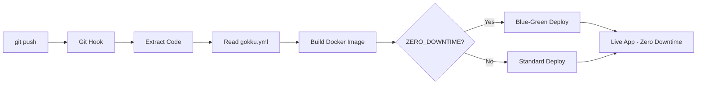

# What is Gokku?

**Gokku** is a lightweight, git-push deployment system designed for Go applications (but supports Python, Node.js, and more).

## The Name

**Gokku** = **Go** + Do**kku**

It's inspired by [Dokku](https://dokku.com/) but focuses on:
- Go-first design
- Simpler configuration
- Docker-native deployment
- Zero-downtime deployments

## Core Philosophy

1. **Git-Push Simplicity**: Deploy with `git push`, just like Heroku
2. **Configuration as Code**: Everything in `gokku.yml`
3. **Sensible Defaults**: Minimal config required
4. **Docker-Native**: All apps run in Docker containers with automatic management

## How It Works



## Key Features

### 🚀 Git-Push Deployment

```bash
git push production main
```

That's it. Your app builds, deploys, and restarts automatically.

### 🔧 Multi-Language

- **Go**: Compiled in Docker with automatic Dockerfile generation
- **Python**: Docker with automatic dependency detection
- **Node.js**: Docker with npm/yarn support
- **Ruby, Rust, etc**: Via custom Dockerfile

### ⚙️ Zero Config (Almost)

Minimal `gokku.yml`:

```yaml
apps:
  api:
    path: ./cmd/api
```

Everything else has defaults:
- Language: Go
- Environment: production
- Branch: main

### 🐳 Docker Native

All apps run in Docker containers:

```yaml
apps:
  api:
    path: ./cmd/api
  
  worker:
    lang: python
    path: ./worker
```

Both deploy as Docker containers with automatic image management.

## Who Is It For?

Perfect for:

- **Go developers** wanting simple deployments
- **Side projects** that don't need Kubernetes
- **Startups** needing fast iteration
- **Dev/staging** environments
- **Learning** deployment workflows

Not ideal for:

- Large-scale production (use Kubernetes)
- Windows servers (Linux only)
- Complex orchestration needs

## What's Next?

- [Getting Started](/guide/getting-started) - Install and deploy your first app
- [Configuration](/guide/configuration) - Learn about `gokku.yml`
- [Examples](/examples/) - See real-world usage

